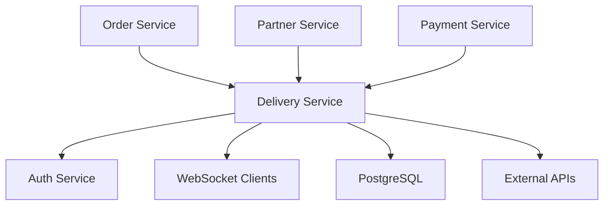

# 🚚 Delivery Service

A comprehensive microservice for managing deliveries, drivers, real-time tracking, and route optimization in the UTH Food Delivery Platform.

## 🌟 Features

### 🚗 Driver Management
- **Driver Registration & Profiles**: Complete driver onboarding with vehicle information, licenses, and documentation
- **Real-time Location Tracking**: GPS-based location updates with WebSocket integration
- **Performance Analytics**: Rating system, delivery statistics, earnings tracking
- **Status Management**: Online/offline status, availability management, break handling
- **Zone Coverage**: Configurable delivery zones and area assignments

### 📦 Delivery Management
- **Order Processing**: Seamless integration with order service for delivery creation
- **Lifecycle Management**: 8-state delivery lifecycle (Pending → Delivered)
- **Priority Handling**: Support for normal, high, and urgent priority deliveries
- **Route Optimization**: Intelligent route planning and distance calculation
- **Proof of Delivery**: Photo uploads, digital signatures, delivery confirmation

### 🗺️ Real-time Tracking
- **Live Location Updates**: Real-time driver and delivery tracking via WebSocket
- **Event Logging**: Comprehensive tracking events (pickup, transit, delivery)
- **Customer Notifications**: Real-time status updates for customers
- **ETA Calculations**: Dynamic estimated time of arrival updates

### 🤖 Smart Assignment
- **Automated Driver Assignment**: AI-powered driver selection algorithm
- **Distance-based Matching**: Find nearest available drivers
- **Load Balancing**: Consider driver workload and capacity
- **Performance-based Selection**: Factor in driver ratings and success rates

### 📊 Analytics & Reporting
- **Delivery Analytics**: Success rates, average times, revenue tracking
- **Driver Performance**: Individual driver statistics and performance metrics
- **Operational Insights**: Peak hours analysis, zone performance, efficiency metrics
- **Real-time Dashboard**: Live operational monitoring and alerts

## 🏗️ Architecture

### Technology Stack
- **Runtime**: Node.js 18+ with TypeScript
- **Framework**: Express.js with Socket.IO for real-time features
- **Database**: PostgreSQL with PostGIS for geospatial data
- **Authentication**: JWT-based authentication with role-based access
- **Real-time**: WebSocket connections for live tracking
- **Containerization**: Docker with multi-stage builds

### Service Integration


## 🚀 Quick Start

### Prerequisites
- Node.js 18+
- PostgreSQL 15+
- Docker & Docker Compose (optional)

### Local Development

1. **Clone and Install Dependencies**
```bash
git clone <repository-url>
cd delivery-service
npm install
```

2. **Database Setup**
```bash
# Create database
createdb delivery_db

# Run migrations
psql -d delivery_db -f ../migrations/delivery_db.sql
```

3. **Environment Configuration**
```bash
cp .env.example .env
# Edit .env with your configuration
```

4. **Start Development Server**
```bash
npm run dev
```

The service will be available at `http://localhost:3004`

### Docker Deployment

1. **Build and Run with Docker Compose**
```bash
docker-compose up -d delivery-service
```

2. **View Logs**
```bash
docker-compose logs -f delivery-service
```

## 📚 API Documentation

### Base URL
- Development: `http://localhost:3004/api`
- Production: `https://api.deliveryservice.com/api`

### Authentication
All endpoints (except public ones) require JWT authentication:
```http
Authorization: Bearer <jwt_token>
```

### Core Endpoints

#### Driver Management
```http
POST   /api/drivers                    # Create driver
GET    /api/drivers                    # List drivers
GET    /api/drivers/:id                # Get driver details
PUT    /api/drivers/:id                # Update driver
PUT    /api/drivers/:id/location       # Update location
PUT    /api/drivers/:id/status         # Update status
GET    /api/drivers/available          # Get available drivers
```

#### Delivery Management
```http
POST   /api/deliveries                 # Create delivery
GET    /api/deliveries                 # List deliveries
GET    /api/deliveries/:id             # Get delivery details
PUT    /api/deliveries/:id             # Update delivery
POST   /api/deliveries/:id/assign      # Assign driver
POST   /api/deliveries/:id/auto-assign # Auto-assign driver
PUT    /api/deliveries/:id/proof       # Submit delivery proof
```

#### Tracking & Events
```http
GET    /api/deliveries/:id/tracking    # Get tracking events
POST   /api/deliveries/:id/tracking    # Create tracking event
```

#### Analytics
```http
GET    /api/analytics/deliveries       # Delivery analytics
GET    /api/analytics/drivers          # Driver analytics
```

#### Integration
```http
POST   /api/integration/order-created  # Handle order creation
POST   /api/integration/calculate-fee  # Calculate delivery fee
```

### Request/Response Examples

#### Create Delivery
```http
POST /api/deliveries
Content-Type: application/json
Authorization: Bearer <token>

{
  "order_id": "123e4567-e89b-12d3-a456-426614174000",
  "customer_id": "123e4567-e89b-12d3-a456-426614174001",
  "restaurant_id": "123e4567-e89b-12d3-a456-426614174002",
  "partner_id": "123e4567-e89b-12d3-a456-426614174003",
  "priority": "NORMAL",
  "pickup_address": "123 Restaurant St, City",
  "pickup_latitude": 40.7128,
  "pickup_longitude": -74.0060,
  "pickup_contact_name": "Restaurant Manager",
  "pickup_contact_phone": "+1234567890",
  "delivery_address": "456 Customer Ave, City",
  "delivery_latitude": 40.7589,
  "delivery_longitude": -73.9851,
  "delivery_contact_name": "John Doe",
  "delivery_contact_phone": "+1234567891",
  "delivery_fee": 5.50,
  "payment_method": "CARD",
  "items_count": 3
}
```

#### Response
```json
{
  "success": true,
  "message": "Delivery created successfully",
  "data": {
    "delivery": {
      "id": "123e4567-e89b-12d3-a456-426614174004",
      "order_id": "123e4567-e89b-12d3-a456-426614174000",
      "status": "PENDING",
      "priority": "NORMAL",
      "estimated_pickup_time": "2024-01-15T10:30:00.000Z",
      "estimated_delivery_time": "2024-01-15T11:00:00.000Z",
      "estimated_distance": 5.2,
      "estimated_duration": 25,
      "created_at": "2024-01-15T10:00:00.000Z"
    }
  }
}
```

## 🔌 WebSocket Events

### Connection
```javascript
const socket = io('http://localhost:3004', {
  auth: {
    token: 'your-jwt-token'
  }
});
```

### Driver Events
```javascript
// Send location update
socket.emit('location:update', {
  latitude: 40.7128,
  longitude: -74.0060,
  heading: 45,
  speed: 25,
  accuracy: 5
});

// Update delivery status
socket.emit('delivery:status:update', {
  delivery_id: 'delivery-uuid',
  status: 'PICKED_UP',
  location: { latitude: 40.7128, longitude: -74.0060 },
  message: 'Order picked up from restaurant'
});
```

### Customer Events
```javascript
// Subscribe to delivery updates
socket.emit('delivery:subscribe', {
  delivery_id: 'delivery-uuid'
});

// Listen for location updates
socket.on('location:update', (data) => {
  console.log('Driver location:', data);
});

// Listen for status updates
socket.on('delivery:status:update', (data) => {
  console.log('Delivery status:', data);
});
```

### Admin Events
```javascript
// Get all active drivers
socket.emit('admin:drivers:get');

// Listen for driver list
socket.on('admin:drivers:list', (data) => {
  console.log('Active drivers:', data.drivers);
});

// Broadcast system message
socket.emit('admin:broadcast', {
  message: 'System maintenance in 30 minutes',
  type: 'warning',
  targets: ['driver', 'customer']
});
```

## 🗃️ Database Schema

### Core Tables

#### Drivers
```sql
CREATE TABLE drivers (
    id UUID PRIMARY KEY DEFAULT uuid_generate_v4(),
    driver_code VARCHAR(20) UNIQUE NOT NULL,
    full_name VARCHAR(100) NOT NULL,
    phone VARCHAR(15) UNIQUE NOT NULL,
    email VARCHAR(100) UNIQUE NOT NULL,
    status driver_status_enum DEFAULT 'OFFLINE',
    vehicle_type vehicle_type_enum NOT NULL,
    current_latitude DECIMAL(10, 8),
    current_longitude DECIMAL(11, 8),
    rating DECIMAL(3,2) DEFAULT 5.00,
    total_deliveries INTEGER DEFAULT 0,
    -- ... additional fields
);
```

#### Deliveries
```sql
CREATE TABLE deliveries (
    id UUID PRIMARY KEY DEFAULT uuid_generate_v4(),
    order_id UUID NOT NULL,
    customer_id UUID NOT NULL,
    restaurant_id UUID NOT NULL,
    partner_id UUID NOT NULL,
    driver_id UUID REFERENCES drivers(id),
    status delivery_status_enum DEFAULT 'PENDING',
    priority delivery_priority_enum DEFAULT 'NORMAL',
    pickup_latitude DECIMAL(10, 8) NOT NULL,
    pickup_longitude DECIMAL(11, 8) NOT NULL,
    delivery_latitude DECIMAL(10, 8) NOT NULL,
    delivery_longitude DECIMAL(11, 8) NOT NULL,
    delivery_fee DECIMAL(10,2) NOT NULL,
    -- ... additional fields
);
```

#### Tracking Events
```sql
CREATE TABLE tracking_events (
    id UUID PRIMARY KEY DEFAULT uuid_generate_v4(),
    delivery_id UUID NOT NULL REFERENCES deliveries(id),
    driver_id UUID REFERENCES drivers(id),
    event_type tracking_event_type_enum NOT NULL,
    timestamp TIMESTAMP NOT NULL DEFAULT CURRENT_TIMESTAMP,
    latitude DECIMAL(10, 8),
    longitude DECIMAL(11, 8),
    description TEXT NOT NULL,
    -- ... additional fields
);
```

## 🔧 Configuration

### Environment Variables

| Variable | Description | Default | Required |
|----------|-------------|---------|----------|
| `NODE_ENV` | Environment (development/production) | development | No |
| `PORT` | Server port | 3004 | No |
| `DB_HOST` | Database host | localhost | Yes |
| `DB_PORT` | Database port | 5432 | Yes |
| `DB_NAME` | Database name | delivery_db | Yes |
| `DB_USER` | Database user | postgres | Yes |
| `DB_PASSWORD` | Database password | - | Yes |
| `JWT_SECRET` | JWT signing secret | - | Yes |
| `ALLOWED_ORIGINS` | CORS allowed origins | localhost:3000 | No |
| `GOOGLE_MAPS_API_KEY` | Google Maps API key for routing | - | No |

### Feature Flags

| Flag | Description | Default |
|------|-------------|---------|
| `ENABLE_REAL_TIME_TRACKING` | Enable WebSocket tracking | true |
| `ENABLE_ROUTE_OPTIMIZATION` | Enable route optimization | true |
| `ENABLE_AUTOMATED_ASSIGNMENT` | Enable auto driver assignment | true |
| `ENABLE_NOTIFICATIONS` | Enable push notifications | true |

## 🔒 Security

### Authentication & Authorization
- **JWT-based Authentication**: Secure token-based authentication
- **Role-based Access Control**: Different permissions for drivers, customers, partners, admins
- **Rate Limiting**: Configurable rate limits per endpoint
- **Request Validation**: Comprehensive input validation and sanitization

### Data Protection
- **Encryption**: Sensitive data encryption at rest and in transit
- **PII Protection**: Personal information handling compliance
- **Audit Logging**: Complete audit trail of all operations
- **CORS Configuration**: Proper cross-origin resource sharing setup

## 📊 Monitoring & Observability

### Health Checks
```http
GET /health                    # Basic health check
GET /api/health               # Detailed health status
```

### Metrics
- **Performance Metrics**: Response times, throughput, error rates
- **Business Metrics**: Delivery success rates, average delivery times
- **System Metrics**: CPU, memory, database connections
- **Real-time Metrics**: Active connections, live deliveries

### Logging
```javascript
// Structured logging with winston
{
  "timestamp": "2024-01-15T10:00:00.000Z",
  "level": "info",
  "service": "delivery-service",
  "operation": "create_delivery",
  "user_id": "user-uuid",
  "delivery_id": "delivery-uuid",
  "duration": 250,
  "status": "success"
}
```

## 🧪 Testing

### Running Tests
```bash
# Run all tests
npm test

# Run tests with coverage
npm run test:coverage

# Run tests in watch mode
npm run test:watch
```

### Test Structure
```
tests/
├── unit/           # Unit tests
│   ├── services/
│   ├── controllers/
│   └── models/
├── integration/    # Integration tests
│   ├── api/
│   └── database/
└── e2e/           # End-to-end tests
    └── scenarios/
```

## 🚀 Deployment

### Docker Production Build
```bash
# Build production image
docker build -t delivery-service:latest .

# Run container
docker run -p 3004:3004 \
  -e NODE_ENV=production \
  -e DB_HOST=your-db-host \
  -e JWT_SECRET=your-secret \
  delivery-service:latest
```

### Kubernetes Deployment
```yaml
apiVersion: apps/v1
kind: Deployment
metadata:
  name: delivery-service
spec:
  replicas: 3
  selector:
    matchLabels:
      app: delivery-service
  template:
    metadata:
      labels:
        app: delivery-service
    spec:
      containers:
      - name: delivery-service
        image: delivery-service:latest
        ports:
        - containerPort: 3004
        env:
        - name: NODE_ENV
          value: "production"
        - name: DB_HOST
          valueFrom:
            secretKeyRef:
              name: delivery-db-secret
              key: host
```

### Performance Considerations
- **Horizontal Scaling**: Stateless design for multiple instances
- **Database Connection Pooling**: Optimized connection management
- **Caching Strategy**: Redis-based caching for frequently accessed data
- **CDN Integration**: Static assets served via CDN

## 🔗 Integration

### Service Communication
```javascript
// Integration with Order Service
const orderServiceClient = {
  async createDelivery(orderData) {
    const response = await axios.post('/api/integration/order-created', {
      order_id: orderData.id,
      customer_id: orderData.customer_id,
      restaurant_id: orderData.restaurant_id,
      // ... other fields
    });
    return response.data;
  }
};
```

### Event-Driven Architecture
```javascript
// Listen for order events
orderEventBus.on('order.created', async (orderData) => {
  await deliveryService.createDelivery(orderData);
});

// Emit delivery events
deliveryEventBus.emit('delivery.completed', {
  delivery_id: delivery.id,
  customer_id: delivery.customer_id,
  completion_time: new Date()
});
```

## 🤝 Contributing

### Development Workflow
1. Fork the repository
2. Create a feature branch (`git checkout -b feature/amazing-feature`)
3. Commit your changes (`git commit -m 'Add amazing feature'`)
4. Push to the branch (`git push origin feature/amazing-feature`)
5. Open a Pull Request

### Code Standards
- **TypeScript**: Strict typing with comprehensive interfaces
- **ESLint**: Code linting with TypeScript rules
- **Prettier**: Code formatting consistency
- **Testing**: Unit tests for all business logic
- **Documentation**: JSDoc comments for public APIs

## 📜 License

This project is licensed under the MIT License - see the [LICENSE](LICENSE) file for details.

## 👥 Team

- **Backend Team**: UTH OOP Project Team
- **Architecture**: Microservices with Event-Driven Design
- **Deployment**: Docker & Kubernetes Ready

## 📞 Support

- **Documentation**: [API Docs](http://localhost:3004/api/docs)
- **Issues**: [GitHub Issues](https://github.com/uth-oop-project/delivery-service/issues)
- **Email**: support@deliveryservice.com

---

**Built with ❤️ by UTH OOP Project Team**