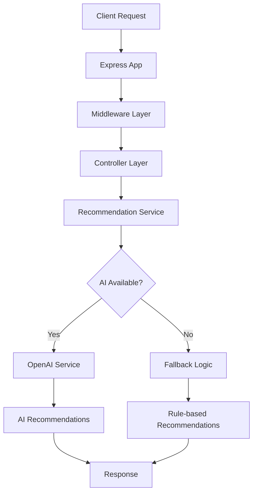

# 🤖 AI Recommendation Service

Intelligent recommendation service for personalized exercise and food suggestions based on user behavior, goals, and preferences. Built with TypeScript, Express.js, and OpenAI integration.

## 🌟 Features

### 🏋️ **Exercise Recommendations**
- **Personalized Workouts**: AI-powered exercise suggestions based on fitness goals
- **Behavior Analysis**: Tracks user preferences and adapts recommendations
- **Goal-Oriented**: Supports weight loss, muscle gain, endurance, strength, flexibility goals
- **Time-Aware**: Considers time of day and user schedule
- **Equipment-Based**: Recommends exercises based on available equipment

### 🥗 **Food Recommendations**
- **Nutritional Intelligence**: Meal suggestions aligned with fitness goals
- **Dietary Restrictions**: Respects allergies and dietary preferences
- **Meal Planning**: Breakfast, lunch, dinner, and snack recommendations
- **Cuisine Preferences**: Vietnamese, Italian, Asian, and more
- **Time & Budget Aware**: Considers cooking time and budget constraints

### 🧠 **AI-Powered Intelligence**
- **OpenAI Integration**: GPT-powered recommendation generation
- **Fallback System**: Rule-based recommendations when AI is unavailable
- **Context Awareness**: Considers weather, season, time of day
- **Behavior Learning**: Improves recommendations based on user interactions

### 📊 **User Analytics**
- **Behavior Tracking**: Comprehensive user interaction logging
- **Goal Progress**: Track fitness goal advancement
- **Preference Learning**: Adaptive recommendation algorithms
- **Performance Metrics**: Success rates and user satisfaction tracking

## 🏗️ Architecture

### Technology Stack
- **Runtime**: Node.js 20+ with TypeScript
- **Framework**: Express.js with comprehensive middleware
- **AI Integration**: OpenAI GPT API with fallback logic
- **Storage**: In-memory (easily extensible to databases)
- **Validation**: Comprehensive request validation and sanitization

### Service Design


## 🚀 Quick Start

### Prerequisites
- Node.js 18+
- npm or yarn
- OpenAI API Key (optional, service works without it)

### Installation

1. **Clone and Install**
```bash
cd recommendation-service
npm install
```

2. **Environment Setup**
```bash
cp .env.example .env
# Edit .env with your configuration
```

3. **Add OpenAI API Key (Optional)**
```bash
# In .env file
OPENAI_API_KEY=your_actual_openai_api_key_here
```

4. **Start Development Server**
```bash
npm run dev
```

Service will be available at `http://localhost:3011`

### Docker Deployment (Optional)
```bash
# Build image
docker build -t recommendation-service .

# Run container
docker run -p 3011:3011 -e OPENAI_API_KEY=your_key recommendation-service
```

## 📚 API Documentation

### Base URL
- Development: `http://localhost:3011/api`
- Health Check: `http://localhost:3011/health`

### Core Endpoints

#### User Management
```http
POST   /api/users                    # Create user profile
GET    /api/users                    # List all users
GET    /api/users/:userId            # Get user details
PUT    /api/users/:userId            # Update user profile
DELETE /api/users/:userId            # Delete user
```

#### Behavior Tracking
```http
GET    /api/users/:userId/behaviors        # Get user behaviors
POST   /api/users/:userId/behaviors        # Track new behavior
```

#### Recommendations
```http
POST   /api/users/:userId/recommendations           # Generate new recommendations
GET    /api/users/:userId/recommendations           # Get existing recommendations
PUT    /api/users/:userId/recommendations/:id       # Update recommendation status

# Specific recommendation types
GET    /api/users/:userId/recommendations/exercises # Exercise recommendations
GET    /api/users/:userId/recommendations/foods     # Food recommendations
GET    /api/users/:userId/recommendations/quick     # Quick mixed recommendations
```

### Request/Response Examples

#### Create User Profile
```http
POST /api/users
Content-Type: application/json

{
  "name": "John Doe",
  "email": "john@example.com",
  "age": 28,
  "gender": "male",
  "height": 175,
  "weight": 70,
  "activityLevel": "moderately_active",
  "dietaryRestrictions": ["gluten_free"],
  "allergies": ["nuts"],
  "fitnessGoals": [
    {
      "type": "weight_loss",
      "target": 65,
      "current": 70,
      "unit": "kg",
      "priority": "high",
      "status": "active"
    }
  ],
  "preferences": {
    "exerciseTypes": ["cardio", "strength"],
    "exerciseDuration": 30,
    "exerciseFrequency": 4,
    "cuisinePreferences": ["vietnamese", "italian"],
    "mealTypes": ["breakfast", "lunch", "dinner"],
    "cookingTime": 30,
    "budgetRange": "medium"
  }
}
```

#### Generate Recommendations
```http
POST /api/users/:userId/recommendations
Content-Type: application/json

{
  "type": "exercise",    # Optional: "exercise", "food", or omit for both
  "count": 5,           # Number of recommendations
  "context": {          # Optional context override
    "timeOfDay": "morning",
    "weatherCondition": "rainy"
  }
}
```

#### Response Example
```json
{
  "success": true,
  "data": [
    {
      "id": "rec_123",
      "userId": "user_456",
      "type": "exercise",
      "category": "cardio",
      "title": "Morning Cardio Run",
      "description": "30-minute cardio workout",
      "content": {
        "name": "Morning Cardio Run",
        "type": "cardio",
        "duration": 30,
        "intensity": "medium",
        "equipment": ["running_shoes"],
        "instructions": [
          "Warm up with 5 minutes walking",
          "Run at moderate pace for 20 minutes",
          "Cool down with 5 minutes walking"
        ],
        "benefits": ["cardiovascular health", "weight loss"],
        "caloriesBurned": 300,
        "difficulty": "intermediate"
      },
      "confidence": 0.85,
      "reasoning": "Perfect for your weight loss goal and morning schedule",
      "tags": ["cardio", "intermediate", "medium"],
      "createdAt": "2024-01-15T06:00:00Z",
      "status": "pending"
    }
  ],
  "metadata": {
    "totalCount": 5,
    "aiGenerated": true,
    "cacheHit": false
  }
}
```

#### Track User Behavior
```http
POST /api/users/:userId/behaviors
Content-Type: application/json

{
  "type": "exercise_completed",
  "action": "completed_workout",
  "metadata": {
    "exerciseType": "cardio",
    "duration": 30,
    "caloriesBurned": 300,
    "difficulty": "medium"
  }
}
```

#### Update Recommendation Status
```http
PUT /api/users/:userId/recommendations/:recommendationId
Content-Type: application/json

{
  "status": "accepted"    # "viewed", "accepted", or "dismissed"
}
```

## 🤖 OpenAI Integration

### Setup Instructions

1. **Get OpenAI API Key**
   - Visit [OpenAI Platform](https://platform.openai.com)
   - Create account and generate API key
   - Add credits to your account

2. **Configure Environment**
```bash
# In .env file
OPENAI_API_KEY=sk-your-actual-api-key-here
OPENAI_MODEL=gpt-3.5-turbo
OPENAI_MAX_TOKENS=500
OPENAI_TEMPERATURE=0.7
```

3. **Enable AI Features**
```bash
ENABLE_AI_RECOMMENDATIONS=true
```

### How It Works

When OpenAI is configured:
1. **Context Building**: Service analyzes user profile, goals, preferences, and recent behaviors
2. **Prompt Generation**: Creates detailed prompts with user context
3. **AI Processing**: Sends prompt to OpenAI GPT model
4. **Response Parsing**: Extracts and validates recommendations from AI response
5. **Fallback**: Uses rule-based logic if AI fails

### AI Prompt Example
```
Generate 5 personalized exercise recommendations for this user:

User Profile:
- Age: 28, Gender: male
- Height: 175cm, Weight: 70kg
- Activity Level: moderately_active
- Current time: morning

Fitness Goals:
- weight_loss: 70/65 kg

Preferences:
- Exercise types: cardio, strength
- Exercise duration: 30 minutes
- Exercise frequency: 4 times/week

Recent Behavior Patterns:
- exercise_completed: completed_workout
- recommendation_clicked: accepted

Please provide recommendations in JSON format...
```

### Cost Optimization
- Efficient prompts to minimize token usage
- Caching for repeated requests
- Fallback to prevent API dependency
- Rate limiting to control costs

## 🔧 Configuration

### Environment Variables

| Variable | Description | Default | Required |
|----------|-------------|---------|----------|
| `NODE_ENV` | Environment | development | No |
| `PORT` | Server port | 3011 | No |
| `OPENAI_API_KEY` | OpenAI API key | - | No |
| `OPENAI_MODEL` | GPT model | gpt-3.5-turbo | No |
| `OPENAI_MAX_TOKENS` | Max response tokens | 500 | No |
| `OPENAI_TEMPERATURE` | AI creativity level | 0.7 | No |
| `ENABLE_AI_RECOMMENDATIONS` | Enable AI features | true | No |
| `ALLOWED_ORIGINS` | CORS origins | localhost:3000 | No |
| `RATE_LIMIT_MAX_REQUESTS` | Rate limit | 100 | No |

### Feature Flags

| Flag | Description | Default | Impact |
|------|-------------|---------|---------|
| `ENABLE_AI_RECOMMENDATIONS` | Use OpenAI API | true | AI vs rule-based |
| `ENABLE_FALLBACK_RECOMMENDATIONS` | Rule-based backup | true | Reliability |
| `CACHE_RECOMMENDATIONS` | Cache responses | true | Performance |

## 🧪 Testing Examples

### Create Test User
```bash
curl -X POST http://localhost:3011/api/users \
  -H "Content-Type: application/json" \
  -d '{
    "name": "Test User",
    "email": "test@example.com",
    "age": 25,
    "gender": "female",
    "height": 165,
    "weight": 60,
    "activityLevel": "lightly_active",
    "dietaryRestrictions": [],
    "allergies": [],
    "fitnessGoals": [{
      "type": "muscle_gain",
      "target": 65,
      "current": 60,
      "unit": "kg",
      "priority": "high",
      "status": "active"
    }],
    "preferences": {
      "exerciseTypes": ["strength", "yoga"],
      "exerciseDuration": 45,
      "exerciseFrequency": 3,
      "cuisinePreferences": ["healthy", "vietnamese"],
      "mealTypes": ["breakfast", "lunch", "dinner"],
      "cookingTime": 25,
      "budgetRange": "medium"
    }
  }'
```

### Get Exercise Recommendations
```bash
curl -X GET "http://localhost:3011/api/users/{userId}/recommendations/exercises?count=3"
```

### Track Behavior
```bash
curl -X POST http://localhost:3011/api/users/{userId}/behaviors \
  -H "Content-Type: application/json" \
  -d '{
    "type": "exercise_completed",
    "action": "finished_strength_training",
    "metadata": {
      "duration": 45,
      "intensity": "high",
      "exercises": ["squats", "deadlifts", "bench_press"]
    }
  }'
```

## 📊 Data Models

### User Profile Structure
```typescript
interface User {
  id: string;
  name: string;
  email: string;
  age: number;
  gender: 'male' | 'female' | 'other';
  height: number; // cm
  weight: number; // kg
  activityLevel: 'sedentary' | 'lightly_active' | 'moderately_active' | 'very_active';
  dietaryRestrictions: string[];
  allergies: string[];
  fitnessGoals: FitnessGoal[];
  preferences: UserPreferences;
}
```

### Recommendation Structure
```typescript
interface Recommendation {
  id: string;
  userId: string;
  type: 'exercise' | 'food';
  category: string;
  title: string;
  description: string;
  content: ExerciseRecommendation | FoodRecommendation;
  confidence: number; // 0-1
  reasoning: string;
  tags: string[];
  status: 'pending' | 'viewed' | 'accepted' | 'dismissed';
}
```

## 🔒 Security & Best Practices

### Input Validation
- Comprehensive request validation
- Email format validation
- Numeric range validation
- Sanitization of user inputs

### Rate Limiting
- Per-IP request limiting
- Configurable windows and limits
- Graceful rate limit responses

### Error Handling
- Structured error responses
- Development vs production error details
- Comprehensive logging

### API Security
- CORS configuration
- Request size limits
- Input sanitization
- Environment variable protection

## 🚀 Production Deployment

### Environment Setup
```bash
# Production environment variables
NODE_ENV=production
PORT=3011
OPENAI_API_KEY=your_production_key
ENABLE_AI_RECOMMENDATIONS=true
ALLOWED_ORIGINS=https://yourdomain.com
```

### Performance Considerations
- **Caching**: Implement Redis for recommendation caching
- **Database**: Replace in-memory storage with PostgreSQL/MongoDB
- **Load Balancing**: Use multiple service instances
- **Monitoring**: Add application performance monitoring

### Scaling Recommendations
- **Horizontal Scaling**: Stateless design supports multiple instances
- **Database Integration**: Add persistent storage layer
- **Caching Layer**: Implement distributed caching
- **Queue System**: Add background job processing

## 🤝 Integration Guide

### With Other Services
```javascript
// Example integration with user service
const recommendationService = {
  async getUserRecommendations(userId, type = null) {
    const response = await fetch(`${RECOMMENDATION_API}/users/${userId}/recommendations${type ? `/${type}s` : ''}`, {
      headers: { 'Authorization': `Bearer ${token}` }
    });
    return response.json();
  }
};
```

### Event-Driven Integration
```javascript
// Listen for user events
userService.on('goal_updated', async (userId, goal) => {
  await recommendationService.trackBehavior(userId, 'goal_updated', 'updated_fitness_goal', { goal });
});

// Listen for workout completions
fitnessService.on('workout_completed', async (userId, workout) => {
  await recommendationService.trackBehavior(userId, 'exercise_completed', 'finished_workout', workout);
});
```

## 📈 Monitoring & Analytics

### Health Monitoring
```bash
# Health check
curl http://localhost:3011/health

# Response
{
  "status": "ok",
  "service": "recommendation-service",
  "timestamp": "2024-01-15T10:00:00Z",
  "uptime": 3600,
  "env": "production"
}
```

### Metrics to Track
- **Recommendation Quality**: User acceptance rates
- **AI Performance**: Response times, success rates
- **User Engagement**: Recommendation interactions
- **System Health**: API response times, error rates

## 🐛 Troubleshooting

### Common Issues

#### OpenAI API Not Working
```bash
# Check API key configuration
curl http://localhost:3011/health
# Look for "OpenAI API Key: Configured" in logs

# Test with fallback
curl -X GET "http://localhost:3011/api/users/{userId}/recommendations/quick"
# Should work with rule-based recommendations
```

#### Rate Limiting Issues
```bash
# Check rate limit headers in response
# Increase limits in .env if needed
RATE_LIMIT_MAX_REQUESTS=200
```

#### Memory Usage
```bash
# Monitor for memory leaks with large user bases
# Consider implementing database storage for production
```

## 📜 License

This project is licensed under the MIT License - see the [LICENSE](LICENSE) file for details.

## 👥 Contributing

1. Fork the repository
2. Create feature branch (`git checkout -b feature/amazing-feature`)
3. Commit changes (`git commit -m 'Add amazing feature'`)
4. Push to branch (`git push origin feature/amazing-feature`)
5. Open Pull Request

## 📞 Support

- **Documentation**: This README and inline code comments
- **Issues**: GitHub Issues for bug reports and feature requests
- **Email**: support@recommendation-service.com

---

**Built with 🤖 AI and ❤️ by UTH OOP Project Team**

*Ready to provide intelligent recommendations for your users' fitness and nutrition journey!*